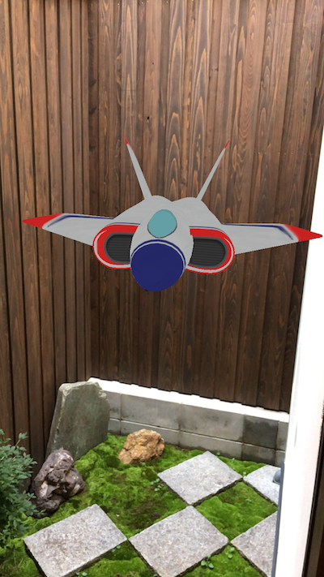
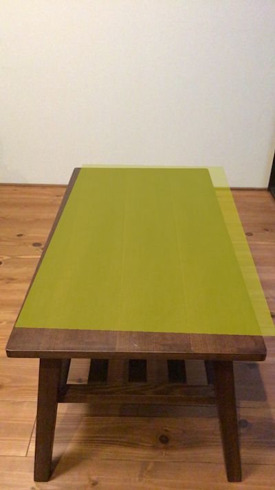
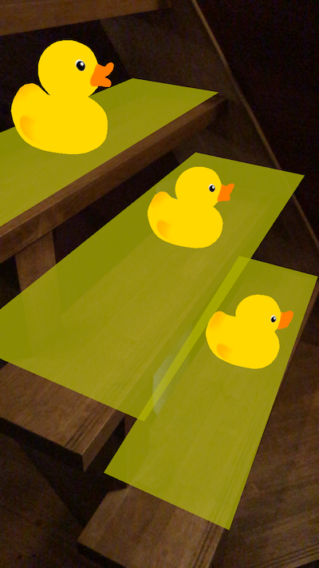
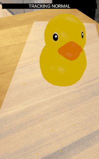
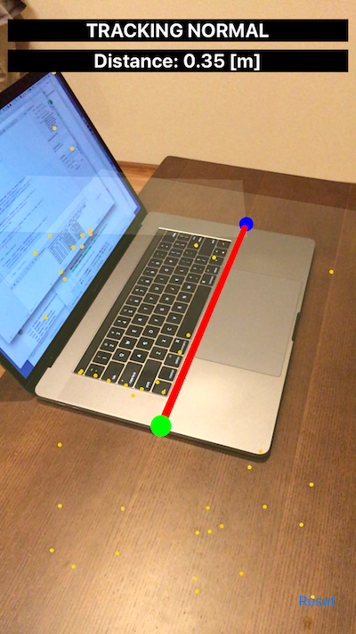
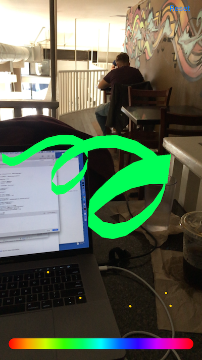

# ARKit-Sampler

ARKit-Sampler is a collection of ARKit samples.

## How to build

Open `ARKit-Sampler.xcworkspace` with Xcode and build it.

It can **NOT** run on **Simulator**.

## Contents

### 3 lines AR

A simple AR with 3 lines code.

### Plane Detection

A sample to show how simply ARKit can detect planes.

### Virtual Object

A sample to show how to add a virtual object to a detected plane.

### AR Interaction

Interactions with virtual objects or detected plane anchors.

### AR Measure

Measuring lengths in the real space.

### AR Drawing

Drawing in the real space.

